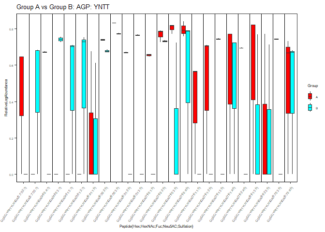
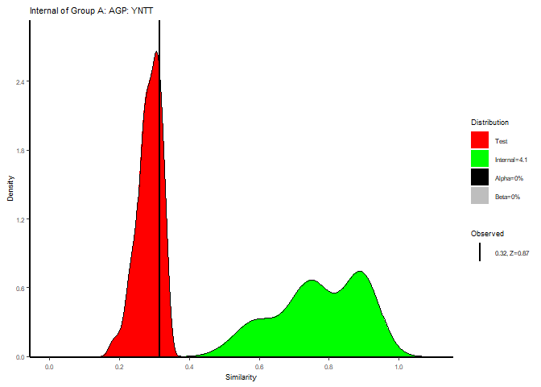
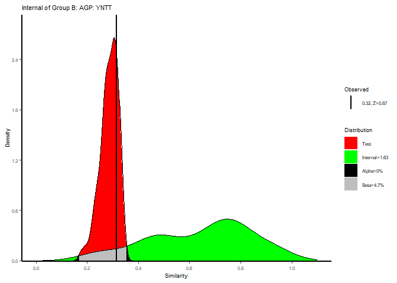
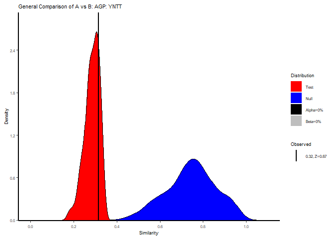

<!-- README.md is generated from README.Rmd. Please edit that file -->

# RAMZIS1

<!-- badges: start -->
<!-- badges: end -->

The goal of RAMZIS (Relative Assessment of m/z Identifications by
Similarity) is to enable glycoproteomic researchers to make more
confident conclusions and plan better follow-up experiments. It does so
through contextual similarity and compares glycopeptides by glycosite.
It can be used to assess the data quality, identify probable glycosite
expression differentiation, and rank the most dissimilar glycopeptide
candidates.

## Installation

You can install the development version of RAMZIS like so:

``` r
#RAMZIS needs devtools to be installed. If you have devtools then comment out the first line
install.packages('devtools')
library(devtools)
install_github('WillHackett22/RAMZIS')
library(RAMZIS1) 
```

Please note that RAMZIS is called with library(RAMZIS1)

## Quick Start

The code provided here is a full run of RAMZIS analysis. It will be
broken up for explanation down below in the next tutorial update. This
code must be altered to the correct system locations and to enable
saving of data before being used .

``` r
library(RAMZIS1)
#Data Cleaning and Glycosite Localizing
FileLocation1<-'C:/Users/wehac/Documents/RAMZIS/extdata/TutorialData/Example1/InitialData'
FileVector1<-paste0(FileLocation1,'/',list.files(FileLocation1)) 
OutFileLocation1<-'C:/Users/wehac/Documents/RAMZIS/extdata/TutorialData/Example1/ProteinOutput'
BaseOutFileName1<-paste0(OutFileLocation1,'/','Example1_Total')
AbundanceObject1<-GlycReRead(Filelist = FileVector1,Outfilename=BaseOutFileName1,SaveResult=F)
GlycositeObject1<-PeptideCollapser(paste0(BaseOutFileName1,'_A1AG1_HUMAN.csv'),Outfilename = paste0(BaseOutFileName1,'_A1AG1_HUMAN'),SaveResult=F)
FileLocation2<-'C:/Users/wehac/Documents/RAMZIS/extdata/TutorialData/Example2/InitialData'
FileVector2<-paste0(FileLocation2,'/',list.files(FileLocation2)) 
OutFileLocation2<-'C:/Users/wehac/Documents/RAMZIS/extdata/TutorialData/Example2/ProteinOutput'
BaseOutFileName2<-paste0(OutFileLocation2,'/','Example2_Total')
AbundanceObject2<-GlycReRead(Filelist = FileVector2,Outfilename=BaseOutFileName2,SaveResult=F)
GlycositeObject2<-PeptideCollapser(paste0(BaseOutFileName2,'_A1AG1_HUMAN.csv'),Outfilename = paste0(BaseOutFileName2,'_A1AG1_HUMAN'),SaveResult=F)
#Comparison of a single glycosite
GroupA<-"C:/Users/wehac/Documents/RAMZIS/extdata/TutorialData/Example3/Mix1_OR_Naive_AGP_ QDQCIYNTTYLNVQR.csv"
GroupB<-"C:/Users/wehac/Documents/RAMZIS/extdata/TutorialData/Example3/Mix5_Naive_AGP_ QDQCIYNTTYLNVQR.csv"
#Sample TIC of A and B
Atic<-c( 6366043225.333893, 6280293021.018555, 4908589823.814423)
Aveclog<-1/log(Atic) #use with logopt=T
Btic<-c(5545327981.925079, 5467932130.947327, 5465953287.68222)
Bveclog<-1/log(Btic)
#plotting the abundances in A and B
BoxplotEx<-BoxplotAbundances(GroupA,GroupB,normvector = list(Aveclog,Bveclog),
                     PlotTitle="Group A vs Group B: AGP: YNTT",
                     group1="A",group2="B",zerofill = T,axislabelsize = 6)
BoxplotEx
```



``` r
#Similarity Comparison Object
SimilarityObject<-RAMZISMain(GroupA,GroupB,normvec = list(Aveclog,Bveclog))
#> [1] "Data Quality Thresholds:: Confidence<=2   OverlapTotal<0.25"
#> [1] "C:/Users/wehac/Documents/RAMZIS/extdata/TutorialData/Example3/Mix1_OR_Naive_AGP_ QDQCIYNTTYLNVQR.csv has an Internal Confidence of 4.1 and total alpha+beta=0"
#> [1] "C:/Users/wehac/Documents/RAMZIS/extdata/TutorialData/Example3/Mix1_OR_Naive_AGP_ QDQCIYNTTYLNVQR.csv has Sufficient Data Quality."
#> [1] "C:/Users/wehac/Documents/RAMZIS/extdata/TutorialData/Example3/Mix5_Naive_AGP_ QDQCIYNTTYLNVQR.csv has an Internal Confidence of 1.63 and total alpha+beta=0.0465116279069767"
#> [1] "C:/Users/wehac/Documents/RAMZIS/extdata/TutorialData/Example3/Mix5_Naive_AGP_ QDQCIYNTTYLNVQR.csv has Insufficient Data Quality for Valid Similarity Assessment between C:/Users/wehac/Documents/RAMZIS/extdata/TutorialData/Example3/Mix1_OR_Naive_AGP_ QDQCIYNTTYLNVQR.csv and C:/Users/wehac/Documents/RAMZIS/extdata/TutorialData/Example3/Mix5_Naive_AGP_ QDQCIYNTTYLNVQR.csv"
#> [1] "C:/Users/wehac/Documents/RAMZIS/extdata/TutorialData/Example3/Mix1_OR_Naive_AGP_ QDQCIYNTTYLNVQR.csv likely has outliers due to multimodality."
#> [1] "C:/Users/wehac/Documents/RAMZIS/extdata/TutorialData/Example3/Mix5_Naive_AGP_ QDQCIYNTTYLNVQR.csv likely has outliers due to multimodality."
#> [1] "Test Similarity Modeling Quality:: Observed Similarity should be between 0.217 and 0.354"
#> [1] "Observed Similarity is 0.315"
#> [1] "RAMZIS Simulation acceptably modeled the comparison of C:/Users/wehac/Documents/RAMZIS/extdata/TutorialData/Example3/Mix1_OR_Naive_AGP_ QDQCIYNTTYLNVQR.csv and C:/Users/wehac/Documents/RAMZIS/extdata/TutorialData/Example3/Mix5_Naive_AGP_ QDQCIYNTTYLNVQR.csv."
#> [1] "Comparison of Test and Null Similarity Distributions Finds:"
#> [1] "Alpha=0"
#> [1] "Beta=0"
#> [1] "Significant Separation of Test and Null Distributions observed with alpha<=0.05 and beta<=0.2in C:/Users/wehac/Documents/RAMZIS/extdata/TutorialData/Example3/Mix1_OR_Naive_AGP_ QDQCIYNTTYLNVQR.csv and C:/Users/wehac/Documents/RAMZIS/extdata/TutorialData/Example3/Mix5_Naive_AGP_ QDQCIYNTTYLNVQR.csv."
```

``` r
#Internal Similarities of A and B
PlotInternalA<-SimPlotInternal("Internal of Group A: AGP: YNTT",SimilarityObject,1)
PlotInternalA
```



``` r
PlotInternalB<-SimPlotInternal("Internal of Group B: AGP: YNTT",SimilarityObject,2)
PlotInternalB
```



``` r
#General Comparison of A and B
PlotGeneral<-SimPlotGeneral("General Comparison of A vs B: AGP: YNTT",SimilarityObject)
PlotGeneral
```



## GlycReRead & PeptideCollapser: Easier Usage of GlycReSoft Search Results

Regardless of the use of the rest of RAMZIS, GlycReSoft users are likely
to find this function useful for collating GlycReSoft search results.
The first function of interest from RAMZIS takes a vector of GlycReSoft
search result .csv files and converts them into a 2D glycopeptide
abundance matrix .csv and a .csv for each protein.

The data used here are included in the RAMZIS package in the extdata
folder.

RAMZIS was made with funding from the NIH and is an open source R
package. Please cite with: WE Hackett, D Chang, L Carvalho, J Zaia
“RAMZIS: a bioinformatic toolkit for rigorous assessment of the
alterations to glycoprotein composition that occur during biological
processes” Bioinformatics Advances 4(1):vbae012
